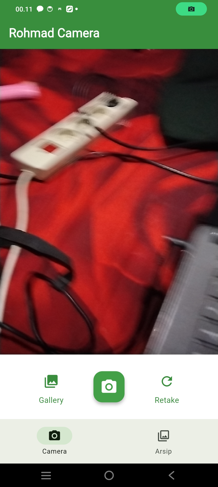
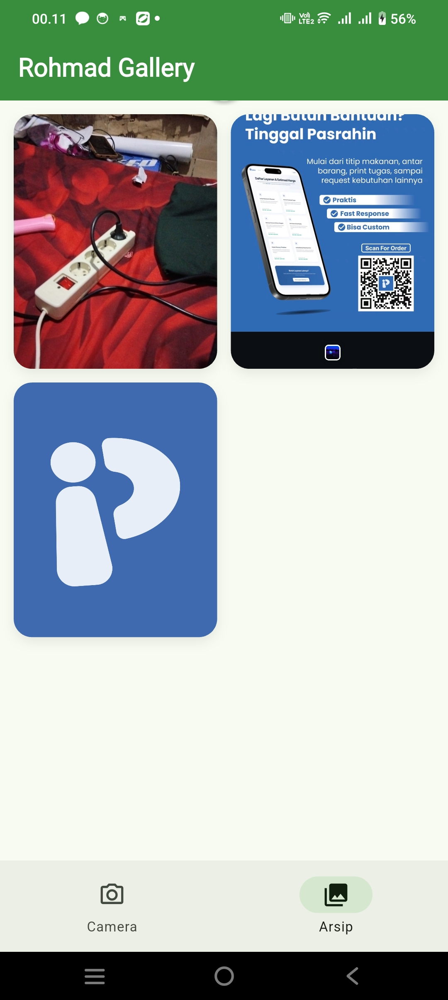

# 📸 Tugas Kamera Flutter

Aplikasi mobile sederhana berbasis Flutter yang menerapkan fitur kamera, upload gambar, dan penyimpanan cloud menggunakan Supabase Storage.

Repository GitHub:
[https://github.com/Rohmadpy/Tugas_Kamera](https://github.com/Rohmadpy/Tugas_Kamera)

---

# ✨ Fitur Utama

* 📷 Ambil foto langsung dari kamera
* 🖼️ Upload gambar dari galeri
* ☁️ Upload image ke Supabase Storage
* 🗂️ Menampilkan daftar gambar pada halaman Arsip
* 🔄 Refresh gallery image

---


# 📱 Tampilan Aplikasi

## Halaman Camera

Tambahkan screenshot halaman Camera di sini.

```md

```

---

## Halaman Arsip

Tambahkan screenshot halaman Arsip di sini.

```md

```

---

# 📂 Struktur Project

```bash
lib/
 ├── main.dart
 ├── camera_page.dart
 ├── arsip_page.dart
 ├── kamera_screen.dart
 └── supabase_service.dart
```

---

# ⚙️ Cara Menjalankan Project

## 1. Clone Repository

```bash
git clone https://github.com/Rohmadpy/Tugas_Kamera.git
```

---

## 2. Install Dependency

```bash
flutter pub get
```

---

## 3. Jalankan Aplikasi

```bash
flutter run
```

---

# ☁️ Konfigurasi Supabase

Tambahkan URL dan Anon Key Supabase pada file `main.dart`:

```dart
const String supabaseUrl = 'YOUR_SUPABASE_URL';
const String supabaseAnonKey = 'YOUR_SUPABASE_ANON_KEY';
```

Buat bucket storage dengan nama:

```text
praktikum-images
```

Dan aktifkan policy upload dan read access.

---


Aplikasi ini memungkinkan pengguna mengambil gambar menggunakan kamera atau galeri, lalu menyimpannya ke cloud Supabase dan menampilkannya kembali pada halaman Arsip.
